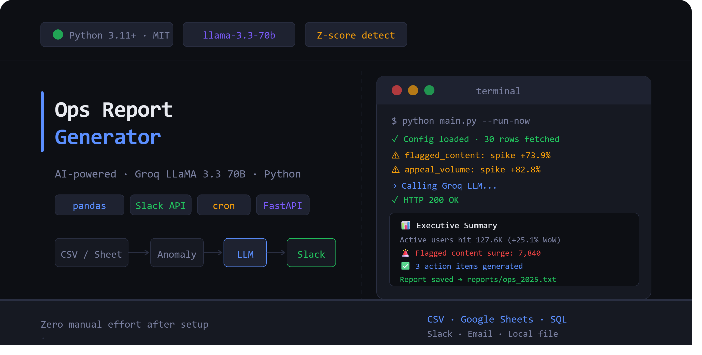

<!-- BANNER -->
<div align="center">
  
</div>

<br/>

<div align="center">

  
  
  
  
  

</div>

<br/>

<div align="center">
  <h3>AI-powered operations report generator.</h3>
  <p>Pulls real metrics → detects anomalies → writes human-readable summaries → delivers to Slack or email on a schedule. Zero manual effort after setup.</p>
</div>

---

## What It Does

```
Your Data                 Pipeline                        Delivery
─────────────     ──────────────────────────────     ──────────────────
Google Sheets  →  1. Pull latest metrics          →  📱 Slack Channel
CSV Export     →  2. Compute stats & WoW trends   →  📧 Email Inbox
SQL Database   →  3. Z-score anomaly detection    →  💾 Local .txt file
               →  4. Groq LLM writes narrative
               →  5. Scheduled auto-delivery
```

**Sample AI-generated output:**

```
📊 Executive Summary
Active users reached 127.6K today (+25.1% WoW), the highest this month.
Flagged content volume surged to 7,840 — a critical anomaly requiring immediate attention.

🚨 Anomalies & Alerts
• flagged_content  → SPIKE +73.9% above 30-day mean (z = 4.2)
  Impact: Moderation team may be overwhelmed. Queue backlog risk high.
• appeal_volume    → SPIKE +82.8% above mean (z = 3.9)
  Impact: Creator trust at risk if appeals are not resolved quickly.

💡 Insights
Surge in user engagement likely driven by recent content push or trending event.
Corresponding moderation spike confirms the growth is organic and high-volume.

✅ Action Items
1. [Moderation Lead]  Investigate coordinated spam/abuse behind content spike
2. [Ops Manager]      Pull in extra moderation capacity for next 48 hours
3. [Creator Team]     Prioritize appeal queue to prevent creator churn
```

---

## Features

- **Multi-source data ingestion** — CSV files, Google Sheets, PostgreSQL, MySQL
- **Real anomaly detection** — Z-score based flagging with configurable sensitivity
- **LLM-generated narratives** — Groq LLaMA 3.3 70B writes the actual report, not templates
- **Scheduled delivery** — daily, weekly, or hourly via cron
- **Slack integration** — formatted block-kit messages with context footer
- **Email delivery** — HTML-formatted emails via Gmail SMTP
- **Local archival** — every report saved as timestamped `.txt` in `/reports`
- **Zero hardcoded content** — every report generated fresh from real data

---

## Project Structure

```
ops-report-generator/
├── main.py                   # CLI entry point + scheduler
├── report_engine.py          # Core pipeline (fetch → anomaly → LLM → deliver)
├── config/
│   └── config.yaml           # All settings — data source, schedule, delivery
├── data/
│   └── sample.csv            # 30-day demo dataset with built-in spike
├── reports/                  # Auto-created — saved report .txt files
├── assets/
│   └── banner.png            # GitHub banner
├── .env.example              # Template for secrets
├── .gitignore
└── requirements.txt
```

---

## Quick Start

### Prerequisites

- Python 3.11+
- A free Groq API key → [console.groq.com](https://console.groq.com)
- (Optional) Slack webhook for delivery
- (Optional) Google service account for Sheets integration

### 1. Clone & Install

```bash
git clone https://github.com/YOUR_USERNAME/ops-report-generator.git
cd ops-report-generator

python -m venv venv
source venv/bin/activate        # Windows: venv\Scripts\activate

pip install -r requirements.txt
```

### 2. Configure Environment

```bash
cp .env.example .env
```

Open `.env` and fill in your keys:

```env
GROQ_API_KEY=gsk_your_key_here
SLACK_WEBHOOK_URL=https://hooks.slack.com/services/YOUR/WEBHOOK/URL
```

### 3. Run with Demo Data

```bash
python main.py --run-now --source csv --file data/sample.csv
```

Report prints to terminal and saves to `reports/`. Done.

---

## Configuration

All settings live in `config/config.yaml`.

### Data Sources

**CSV** — simplest, no setup needed:
```yaml
data_source:
  type: csv
  csv:
    filepath: data/your_export.csv
```

**Google Sheets** — needs a service account JSON:
```yaml
data_source:
  type: gsheet
  gsheet:
    sheet_id: "YOUR_SHEET_ID_FROM_URL"
    range: "Sheet1!A1:H100"
    credentials_path: "config/google_credentials.json"
```

**SQL Database** — PostgreSQL or MySQL:
```yaml
data_source:
  type: sql
  sql:
    connection_string: "${DATABASE_URL}"
    query: |
      SELECT date, metric1, metric2
      FROM ops_metrics
      WHERE date >= CURRENT_DATE - INTERVAL '30 days'
      ORDER BY date
```

### Team Context (Important)

The `team_context` field directly improves LLM report quality. Be specific:

```yaml
report:
  team_context: >
    AB Operations team. We track content moderation volume,
    creator activity, and platform safety metrics.
    Our KPIs are moderation backlog, creator retention, and flagged content rate.
```

### Schedule

```yaml
schedule:
  frequency: daily     # daily | weekly | hourly
  time: "08:30"        # 24-hour format
  day: monday          # only used when frequency: weekly
```

---

## CLI Reference

```bash
# Run once immediately
python main.py --run-now

# Run with specific CSV
python main.py --run-now --source csv --file data/export.csv

# Run with Google Sheets
python main.py --run-now --source gsheet

# Run with SQL database
python main.py --run-now --source sql

# Start scheduler (keeps running)
python main.py --schedule

# Use a custom config file
python main.py --run-now --config config/weekly_config.yaml
```

---

## Delivery Setup

### Slack Webhook

1. Go to [api.slack.com/apps](https://api.slack.com/apps) → Create New App → From Scratch
2. Incoming Webhooks → Turn On → Add to Workspace → select your channel
3. Copy the Webhook URL → add to `.env` as `SLACK_WEBHOOK_URL`
4. In `config.yaml` set `delivery.slack.enabled: true`

### Gmail / Email

1. Enable 2-Factor Auth on your Google account
2. Visit [myaccount.google.com](https://myaccount.google.com) → Security → App Passwords
3. Generate password for "Mail" → copy it
4. Add to `.env`: `SMTP_USER` and `SMTP_PASSWORD`
5. In `config.yaml` set `delivery.email.enabled: true` and add recipients

### Google Sheets

1. Go to [console.cloud.google.com](https://console.cloud.google.com) → Enable Google Sheets API
2. IAM & Admin → Service Accounts → Create → Download JSON key
3. Save as `config/google_credentials.json`
4. Share your Google Sheet with the service account email from the JSON file

---

## How Anomaly Detection Works

Uses the **Z-score method** — statistically flags values that deviate significantly from the 30-day baseline:

```
Z-score = (latest_value − rolling_mean) / rolling_std

Flag if |Z-score| ≥ 2.0    →  top/bottom 5%  — notable
Flag if |Z-score| ≥ 3.0    →  top/bottom 0.3% — critical
```

The LLM receives each anomaly with its direction (spike/drop), percentage deviation, and Z-score, then writes a plain-English explanation of the business impact.

Sensitivity is configurable:

```yaml
report:
  anomaly_z_threshold: 2.0   # lower = more alerts, higher = less noise
```

---

## Demo Dataset

`data/sample.csv` contains 30 days of synthetic ops metrics with a **deliberate spike on Day 30**:

| Metric | Normal Range | Day 30 Value | Change |
|---|---|---|---|
| flagged_content | ~4,500 | 7,840 | +73.9% |
| appeal_volume | ~330 | 612 | +82.8% |
| moderation_actions | ~4,200 | 7,120 | +67.9% |
| active_users | ~102K | 127.6K | +25.1% |

Run the demo to see full anomaly detection and LLM callouts in action.

---

## Environment Variables

| Variable | Required | Description |
|---|---|---|
| `GROQ_API_KEY` | ✅ Yes | Groq API key — get free at console.groq.com |
| `SLACK_WEBHOOK_URL` | If Slack enabled | Slack incoming webhook URL |
| `SMTP_USER` | If email enabled | Gmail address |
| `SMTP_PASSWORD` | If email enabled | Gmail App Password (not login password) |
| `DATABASE_URL` | If SQL source | SQLAlchemy connection string |

---

## Troubleshooting

| Error | Fix |
|---|---|
| `GROQ_API_KEY not set` | Add key to `.env` file, not `config.yaml` |
| `ModuleNotFoundError: report_engine` | Add `sys.path.insert(0, 'backend')` at top of `main.py` |
| `UnicodeEncodeError` on Windows | Change `open(filepath, "w")` to `open(filepath, "w", encoding="utf-8")` |
| `Slack: 400 invalid_payload` | Check webhook URL is complete and unmodified |
| `Google Sheets 403 Forbidden` | Share the sheet with your service account email |
| `No numeric columns detected` | Explicitly list column names under `numeric_columns` in config |
| LLM writes generic report | Make `team_context` more specific to your actual team and KPIs |

---

## Roadmap

- [ ] WhatsApp delivery via Twilio
- [ ] PDF report export with charts
- [ ] FastAPI web UI for on-demand report generation
- [ ] Multi-sheet data merging
- [ ] Historical report comparison (this week vs last week)
- [ ] Language-wise breakdown for multilingual platforms

---

## Tech Stack

| Layer | Technology |
|---|---|
| Language | Python 3.11+ |
| LLM | Groq · LLaMA 3.3 70B Versatile |
| Data | pandas · SQLAlchemy |
| Sheets | Google Sheets API v4 |
| Delivery | Slack Incoming Webhooks · SMTP |
| Scheduling | schedule library · cron |
| Config | YAML + python-dotenv |

---

##  License

MIT License — free to use, modify, and distribute. Attribution appreciated.

---

<div align="center">
  <sub>Built for operations and analytics teams at content and social media platforms.</sub><br/>
  <sub>⭐ Star this repo if it helped you — it supports continued development.</sub>
   <sub> AB . </sub>
</div>
